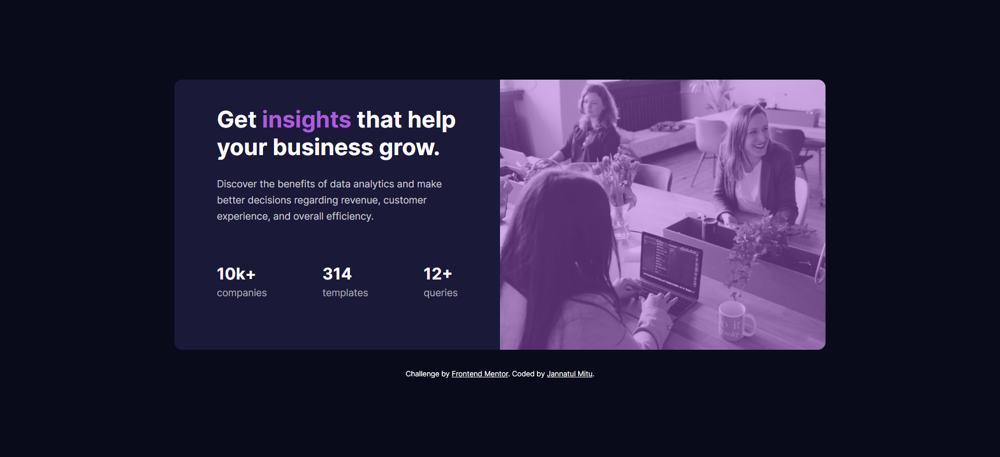
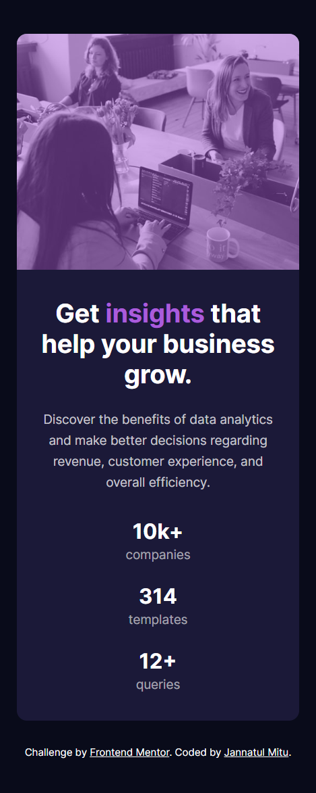

# Frontend Mentor - Stats preview card component solution

This is a solution to the [Stats preview card component challenge on Frontend Mentor](https://www.frontendmentor.io/challenges/stats-preview-card-component-8JqbgoU62). Frontend Mentor challenges help you improve your coding skills by building realistic projects. 

## Table of contents

- [Overview](#overview)
  - [The challenge](#the-challenge)
  - [Screenshot](#screenshot)
  - [Links](#links)
- [My process](#my-process)
  - [Built with](#built-with)
  - [What I learned](#what-i-learned)
- [Author](#author)

## Overview

### The challenge

Users should be able to:

- View the optimal layout depending on their device's screen size

### Screenshot

#### Desktop


#### Tablet


#### Mobile



### Links

- Solution URL: [Add solution URL here](https://github.com/jannatulmitu03/stats-preview-card)
- Live Site URL: [Add live site URL here](https://jannatulmitu03.github.io/stats-preview-card)

## My process

### Built with

- Semantic HTML5 markup
- CSS custom properties
- Flexbox
- CSS Pseudo-elements
- Desktop-first workflow


### What I learned

- How to add a `color overlay` to a background image

```css
.hero-img{
    position: relative;
}
.hero-img::before{
    content: "";
    width: 100%;
    height: 100%;
    top: 0;
    left: 0;
    position: absolute;
    background-color: hsla(277, 64%, 61%, 0.478);
}
```

## Author

- Website - [Jannatul Mitu](https://www.linkedin.com/in/jannatulmitu03)
- Frontend Mentor - [@jannatulmitu03](https://www.frontendmentor.io/profile/jannatulmitu03)
- Twitter - [@jannatulmitu03](https://twitter.com/jannatulmitu03)